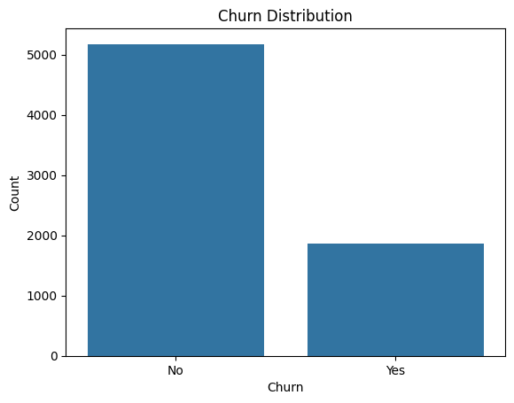
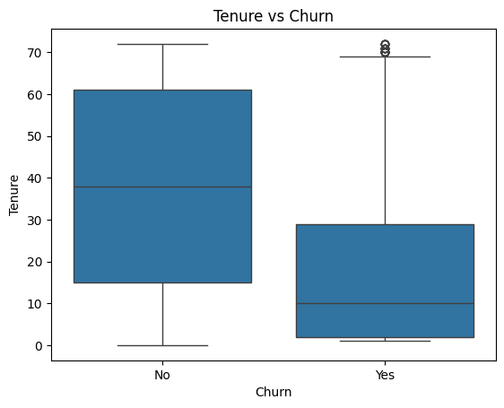
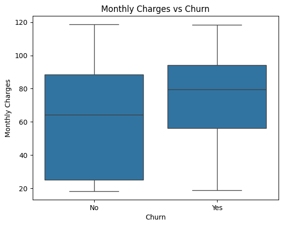
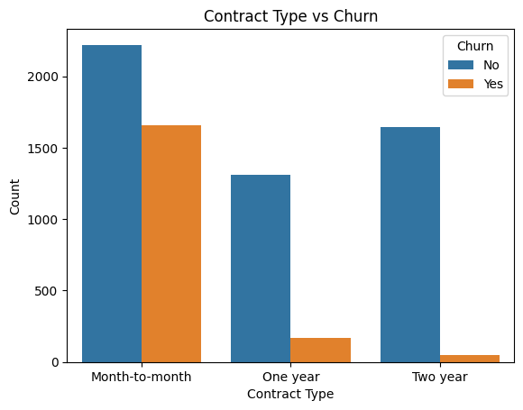

# Customer Churn Prediction using Artificial Neural Network


# Problem Statement
Telecom companies lose significant revenue due to customer churn.
This project explores the Telco Customer Churn dataset to identify
key patterns and factors that lead customers to cancel their subscription
and builds an ANN model to predict churn before it happens.

# Dataset
- Source: Telco Customer Churn Dataset (Kaggle)
- Total Customers: 7043
- Total Features: 21
- Target Variable: Churn (Yes/No)
- Class Distribution: 73.5% Retained & 26.5% Churned

#  Key EDA Findings
1. Dataset Imbalance: 73.5% customers retained vs 26.5% churned — dataset is imbalanced and requires careful handling during model evaluation.
2. Tenure Impact: Churned customers have median tenure of only 10 months vs 38 months for retained customers — new customers are significantly more likely to churn.
3. Monthly Charges: Customers who churned have higher median monthly charges of 82 dollars vs 65 dollars for retained customers — high charges drive churn.
4. Contract Type: Month to month contract customers churn at significantly higher rate — no long term commitment makes switching easy.
5. Payment Method: Electronic check users show highest churn risk — automatic payment users are significantly more loyal.

#  ANN Architecture

Input Layer → 30 neurons
Hidden Layer 1 → 64 neurons (ReLU + L2 Regularization + Dropout 0.3)
Hidden Layer 2 → 32 neurons (ReLU + L2 Regularization + Dropout 0.3)
Hidden Layer 3 → 16 neurons (ReLU + L2 Regularization + Dropout 0.3)
Output Layer → 1 neuron (Sigmoid)


#  Model Results

| Metric | Score |
|--------|-------|
| Accuracy | 77% |
| Recall | 72.4% |
| Precision | 54.9% |
| F1 Score | 0.625 |
| AUC ROC | 0.848 |

#  Experiments Performed

| Experiment | Result | Decision |
|------------|--------|----------|
| With SMOTE | Recall↑ F1↓ | Not Used |
| Without SMOTE | Better F1 |  Used |
| Threshold 0.5 | Low Recall | Not Used |
| Threshold 0.3 | Better Recall |  Used |

#  Business Insights
- New Customers: Offer 24x7 support, welcome discounts, and personalized engagement during first few months. Since customers with shorter tenure are more likely to churn, improving their initial experience increases retention.
- High Charge Customers: Provide loyalty rewards, personalized discounts, or premium customer support. Customers with higher monthly charges churn when they do not get sufficient value for price they pay.
- Electronic Check Users: Encourage switch to automatic bank transfers or credit card payments by offering cashback or discounts. Electronic check users tend to have higher churn rates.

# Tech Stack

| Category | Tools |
|----------|-------|
| Language | Python 3.10 |
| Deep Learning | TensorFlow, Keras |
| ML Libraries | Scikit-learn |
| Data Analysis | Pandas, Numpy |
| Visualization | Matplotlib, Seaborn |
| Web App | Streamlit |
| Model Saving | Joblib, H5py |

# Project Structure

CustomerChurnPrediction/
│
├── 📂 data/
│ └── Telco-Customer-Churn.csv
│
├── 📂 notebooks/
│ ├── EDA.ipynb
│ └── Model.ipynb
│
├── 📂 models/
│ ├── churn_model.keras
│ └── scaler.pkl
│
├── 📂 images/
│ └── (EDA and Model graphs)
│
├── app.py
├── requirements.txt
└── README.md


# How to Run Locally

Step 1 — Clone Repository
```bash
git clone https://github.com/ansh-parikh-ai/Customer-Churn-Prediction.git
```

Step 2 — Install Requirements
```bash
pip install -r requirements.txt
```

Step 3 — Run Streamlit App
```bash
streamlit run app.py
```

# EDA Visualizations

| Churn Distribution | Tenure vs Churn |
|---|---|
|  |  |

| Monthly Charges vs Churn | Contract Type vs Churn |
|---|---|
|  |  |

#  Why These Design Decisions

Why Threshold 0.3:
Missing a churning customer costs more than a false alarm.
Lowering threshold improves Recall i.e, catches more churning customers
and enables timely retention strategies.

Why No SMOTE:
After comparing results with and without SMOTE —
overall balanced performance was better without SMOTE.
F1 Score and AUC ROC were both better without oversampling.

Why L2 Regularization and Dropout:
Prevents overfitting — training and validation accuracy
remain close confirming good generalization of model.

# What I Learned
- Improving an ANN is not only about adding more layers or neurons. Proper data preprocessing, feature scaling, regularization, and evaluation metrics have greater impact on model performance than increasing model complexity.
- The most challenging part was finding the right balance between precision and recall while avoiding overfitting. Experimenting with SMOTE, dropout, and L2 regularization helped me understand trade-offs involved in building a stable model.
- Machine learning models should be optimized based on business objectives rather than accuracy alone. In churn prediction, identifying customers likely to leave (high recall) is more valuable than maximizing overall accuracy.
- Next time I would compare multiple models such as XGBoost, LightGBM, and Random Forest and perform extensive hyperparameter tuning.

# Future Improvements
- Compare ANN with XGBoost, LightGBM and Random Forest
- Add real time prediction API using FastAPI
- Experiment with advanced feature engineering
- Deploy on cloud platform with CI/CD pipeline
- Collect more recent telecom data for retraining

# Author
**Ansh Parikh**
- GitHub: [@ansh-parikh-ai](https://github.com/ansh-parikh-ai)
- LinkedIn: www.linkedin.com/in/ansh-parikh-b6b5a2379

⭐ If you found this project helpful, please give it a star!
